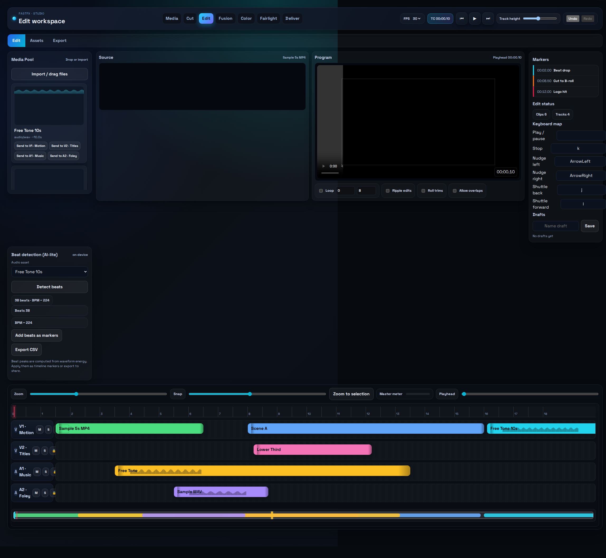

# Timeline Builder (fastfx)

React + Vite timeline prototype with snapping, ripple edits, loop ranges, waveform/thumb ingest, and mock export presets. Playwright smoke tests auto-produce screenshots and a short run video.

## Quick start
- `cd web`
- `npm install`
- `npm run dev -- --host --port 4178` then open http://localhost:4178

## Latest captures (`web/screenshots/`)
| Edit overview | Assets tab | Beat detection | Export tab |
| --- | --- | --- | --- |
|  |  |  |  |

Full run video: `web/screenshots/timeline-run.webm`

## Tests & build (run from `web/`)
- Smoke test + recording: `npm run test:e2e`
- Production build: `npm run build`
- Playwright browsers live in `~/.cache/ms-playwright`; if running from an NTFS path, set `PLAYWRIGHT_BROWSERS_PATH=~/.cache/ms-playwright` to avoid chmod issues.

## Sample media
Bundled free assets live in `web/public/samples/`:
- `free-tone-10s.wav` – 10s sine tone (public domain)
- `mars-1280.jpg` – NASA/ESA Mars true-color photo (public domain)
- Legacy Samplelib files: `sample-5s.mp4`, `sample-3s.wav`, `sample-photo.jpg`
Use the Assets tab file picker or drag these into tracks.

## Feature snapshot
- Playback with loop ranges; track mute/solo/lock honored.
- Trims: ripple, roll, slip, slide with snap-to-marker/edge/gap.
- Visuals: waveforms on audio clips; captured thumbs on video clips; compact track height toggle.
- Preview: monitor follows active video clip; audio via Web Audio.
- Asset ingest: waveform + thumbnail extraction; drag/drop or “Send to track”.
- Export: mock presets (JSON/MP4/WebM) plus the Playwright smoke that records screenshots + video.

See `web/README.md` for deeper notes, shortcuts, and file map.
