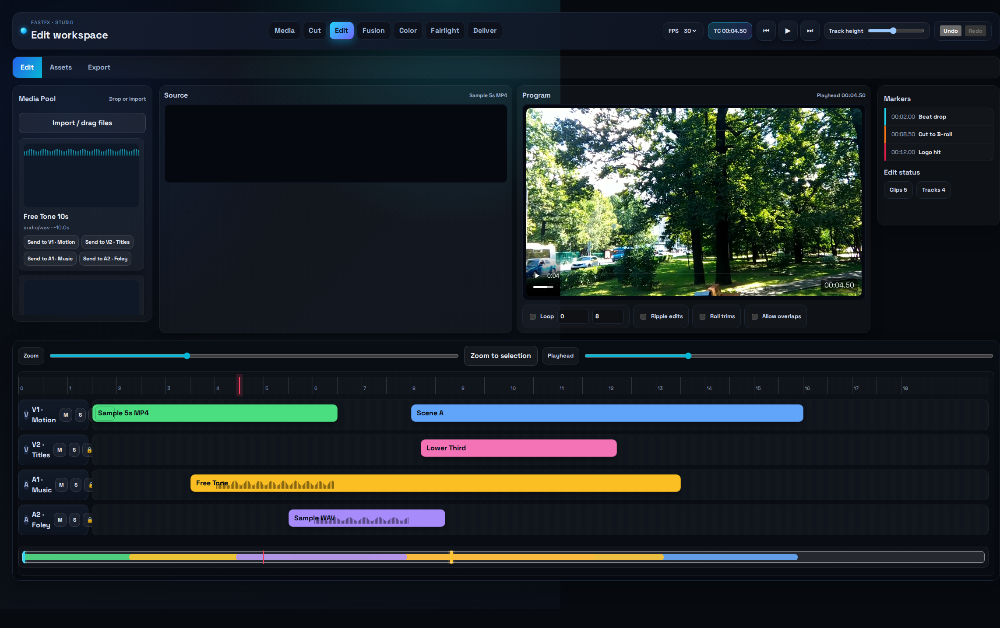
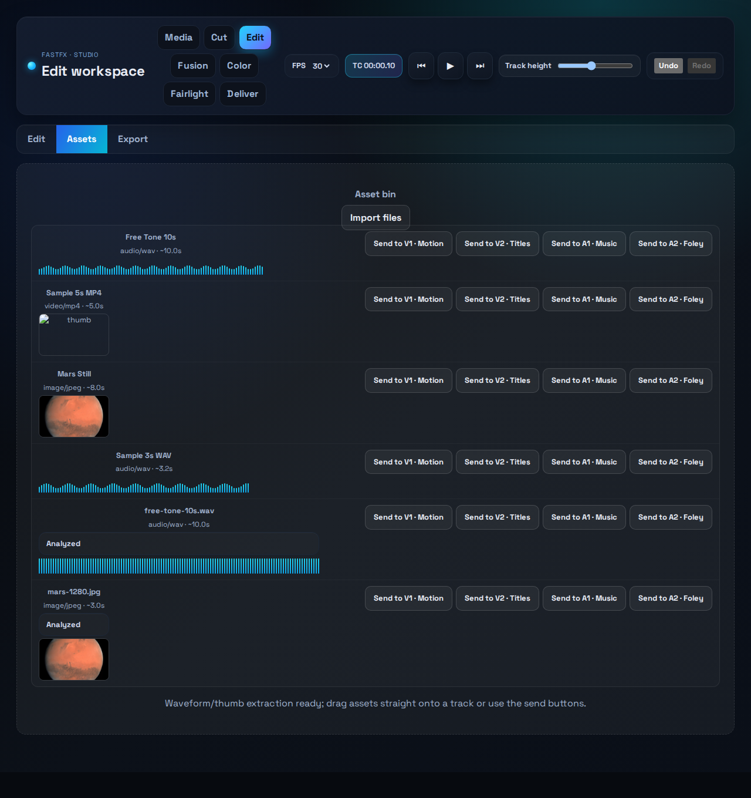
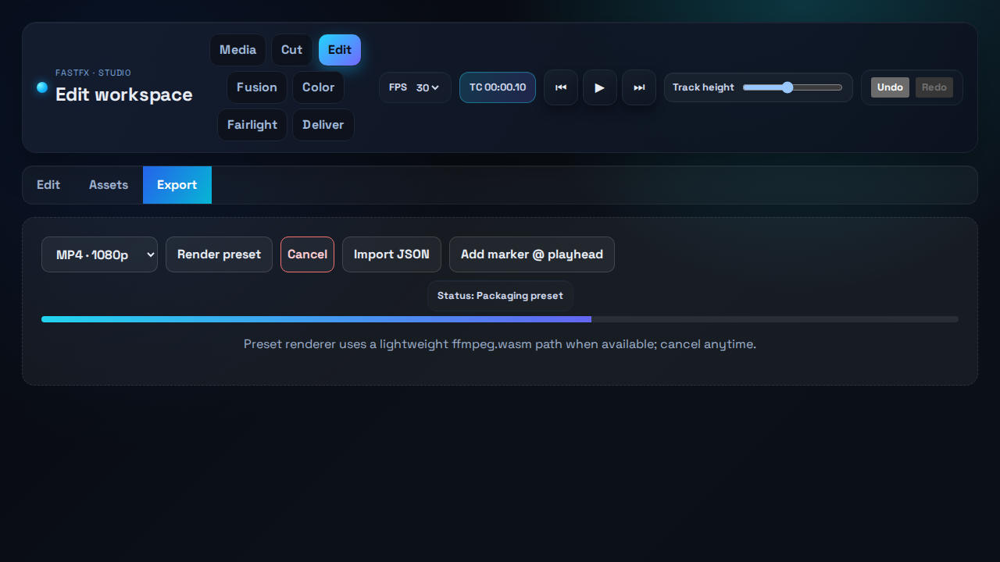

# Timeline Builder (React + Vite)

Premiere-style timeline prototype with snapping, loop ranges, ripple edits, asset ingest, and export presets. Ships with free sample media and an automated Playwright smoke that records a video + screenshots.

Latest captures (auto-generated by Playwright):

| Edit overview | Assets tab (with NASA image + tone) | Export tab |
| --- | --- | --- |
|  |  |  |

Short run-through video:

<video src="./screenshots/timeline-run.webm" controls width="820"></video>

## Quick start
1) Install deps: `npm install`
2) Dev server: `npm run dev -- --host --port 4178`
3) Open http://localhost:4178

## Sample media
Free-to-use files are bundled in `public/samples/`:
- `free-tone-10s.wav` – 10s sine tone generated in-house (public domain)
- `mars-1280.jpg` – NASA/ESA Mars true-color photo (public domain)
- Legacy Samplelib files: `sample-5s.mp4`, `sample-3s.wav`, `sample-photo.jpg` (test/demo friendly)
Use the **Assets** tab file picker or drag these into the timeline tracks.

## Feature snapshot
- Playback: audio + video synced to playhead; loop ranges; track mute/solo/lock respected.
- Trims: ripple, roll, slip, slide (Alt+trim handles); snapping to markers/edges/gaps.
- Visuals: audio waveforms on clips; video thumbnails captured on import; per-track compact height toggle.
- Preview: left-panel video monitor follows active video clip; audio via Web Audio.
- Asset ingest: waveform and thumb extraction; drag/drop to tracks or “Send to track”.
- Export: mock presets (JSON/MP4/WebM) plus Playwright smoke that records screenshots + a run video.

## Features exercised in the UI
- Tracks with draggable clips, trim handles, marquee multi-select, undo/redo.
- Snap refinement: grid/marker/gap/edge targets with a labeled snap ghost.
- Ripple edits toggle to shift downstream clips on move/trim.
- Loop range with minimap handles and main-timeline overlay; playhead looping.
- Zoom & pan: wheel+modifier zoom, Shift+wheel horizontal pan, zoom-to-selection.
- Asset bin: duration/metadata, waveform (audio) + image thumb, drag or “Send to track”.
- Markers list is clickable to jump the playhead.
- Export presets: JSON bundle plus mock MP4/WebM render download.

## Keyboard bits
- Space play/pause; J/K/L shuttle; Arrow left/right nudge selected clips (Shift = bigger step).
- Cmd/Ctrl+Z / Shift+Cmd/Ctrl+Z undo/redo; Cmd/Ctrl+D duplicate selected clips.

## Testing & captures
- E2E smoke (records video + screenshot): `npm run test:e2e`
  - Outputs: `screenshots/timeline.png` and `screenshots/timeline-run.webm`.
- Production build: `npm run build`
- Browsers: Playwright’s binaries live in `~/.cache/ms-playwright` (ext4). If you run tests from the NTFS repo path, set `PLAYWRIGHT_BROWSERS_PATH=~/.cache/ms-playwright` to reuse the existing cache and avoid chmod errors.

## File map
- `src/App.tsx` – main timeline UI & interactions
- `src/App.css` – styling
- `playwright.config.ts`, `tests/smoke.spec.ts` – smoke coverage (snap, loop, assets, export)
- `screenshots/` – latest screenshot & test video
- `public/samples/` – bundled demo media

## Notes
- Export rendering is mocked; swap the placeholder encoder with ffmpeg/wasm when ready.
- Waveform decoding uses Web Audio; falls back gracefully if unavailable.
